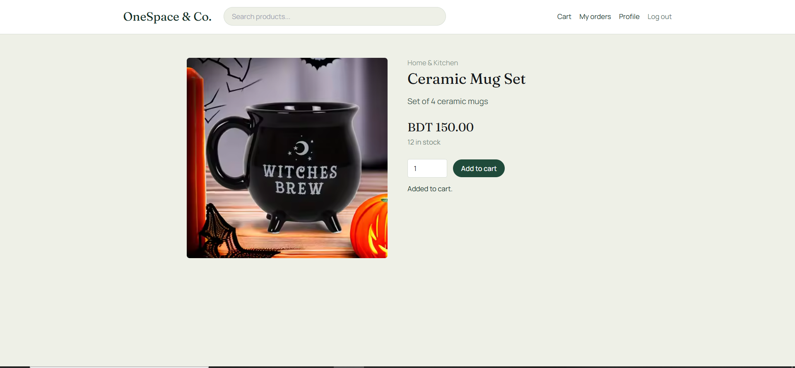
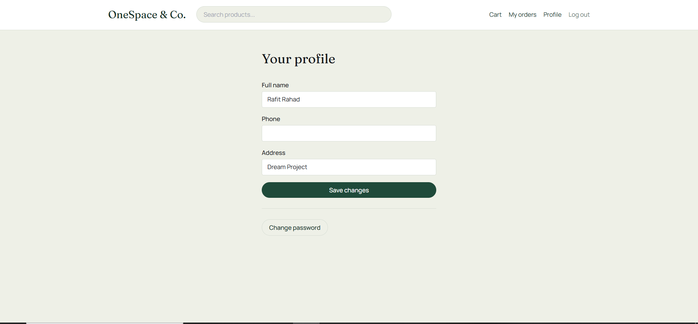

# OneSpace — Role-Based E-Commerce Platform

A full-stack e-commerce management platform with three distinct roles — **Admin**,
**Shop Manager**, and **Customer** — each with their own permissions and dashboard.
Built with **NestJS**, **PostgreSQL**, and **TypeORM** on the backend, and **Next.js**,
**Tailwind CSS**, and **Zod** on the frontend.

---

## Table of contents

- [Features](#features)
- [Screenshots](#screenshots)
- [Tech stack](#tech-stack)
- [Architecture](#architecture)
- [Project structure](#project-structure)
- [Getting started](#getting-started)
- [Demo accounts](#demo-accounts)
- [Environment variables](#environment-variables)
- [API overview](#api-overview)
- [Security](#security)

---

## Features

### 👑 Admin
- Manage users (view, change role, activate/deactivate, delete)
- Manage products (full CRUD, image upload or URL)
- Manage categories (full CRUD)
- Manage orders (view all, update fulfillment status)
- Manage inventory (adjust stock, view movement logs, low-stock report)
- View sales and revenue dashboard
- Create and manage staff (Manager/Admin) accounts

### 🧑‍💼 Shop Manager
- Manage products (full CRUD, image upload or URL)
- Manage inventory (adjust stock, view movement logs)
- Process orders (update fulfillment status)
- View sales and revenue dashboard

### 🛍️ Customer
- Browse, search, and filter products by category and price
- Add items to cart, adjust quantities
- Checkout and place orders
- View order history, cancel eligible orders
- Manage profile details and change password

### Account & security
- Registration and login with hashed (bcrypt) passwords
- Strong password policy enforced client- and server-side
- Forgot password / reset password via emailed link (1-hour expiry)
- Change password from account settings (modal, current password required)
- Rate limiting on auth endpoints to block brute-force attempts
- Secure HTTP headers (Helmet)
- Role-based route protection on both frontend and backend

---

## Screenshots

### Storefront (Customer view)

**Home page** — search, category and price filters, product grid:


**Live search** — filters the grid as you type, synced with the URL:


**Product detail** — with add-to-cart:


**Cart** — quantity editing and running total:


**Order history** — with cancel option while an order is still pending/processing:


**Profile** — update details, plus a "Change password" button:


**Change password** — modal with current/new/confirm password:


### Auth flows

**Login:**


**Register:**


**Forgot password:**


### Shop Manager Dashboard

*(Admin sees the same dashboard shell, plus extra sections for Categories, Customers &
Staff, and Staff Roles — see [Features](#features) above.)*

**Overview & sales:**


**Products** — full CRUD with add/edit/delete:


**Inventory** — stock adjustment and low-stock alerts:


**Orders** — process and update fulfillment status:


---

## Tech stack

| Layer | Technology |
|---|---|
| Backend framework | [NestJS](https://nestjs.com/) (Node.js / TypeScript) |
| Database | PostgreSQL |
| ORM | TypeORM |
| Auth | JWT (`@nestjs/jwt`, `passport-jwt`), bcrypt password hashing |
| Rate limiting | `@nestjs/throttler` |
| Security headers | `helmet` |
| File uploads | `multer` |
| Frontend framework | [Next.js](https://nextjs.org/) 14 (App Router) |
| Styling | Tailwind CSS |
| Forms & validation | `react-hook-form` + `zod` |
| HTTP client | `axios` |

---

## Architecture

Both the backend and frontend are organized in an explicit **Model / View / Controller**
layout rather than the framework's usual co-located structure, for clarity:

```
backend/
  src/
    models/        Model      -> TypeORM entities (User, Product, Order, ...)
    dto/                      -> request validation shapes
    controllers/   Controller -> route handlers
    services/                 -> business logic
    modules/                  -> wires model + controller + service per feature
    guards/ decorators/       -> JWT auth guard, RolesGuard, @Roles(), @CurrentUser()

frontend/
  src/
    models/        Model      -> TypeScript types + Zod schemas
    controllers/   Controller -> API service functions, AuthProvider
    views/         View       -> full page UI implementations
    components/               -> shared UI atoms (Button, Modal, RoleGuard, ...)
  app/                        -> Next.js routes; each route renders its matching View
```

### Entity relationship diagram

Generated directly from the live database schema (pgAdmin's ERD Tool):


Every table uses a UUID primary key and real foreign key constraints enforced by
PostgreSQL (not just application-level references):

| Table | Foreign keys |
|---|---|
| `products` | `categoryId` → `categories.id` |
| `orders` | `userId` → `users.id` |
| `order_items` | `orderId` → `orders.id`, `productId` → `products.id` |
| `cart_items` | `userId` → `users.id`, `productId` → `products.id` |
| `inventory_logs` | `productId` → `products.id` |

---

## Project structure

```
shopmvc-project/
├── backend/     NestJS API (port 4000)
├── frontend/    Next.js app (port 3000)
└── docs/
    └── screenshots/   Images used in this README
```

---

## Getting started

### Prerequisites
- Node.js 18+
- PostgreSQL running locally (or a connection string to a remote instance)

### 1. Backend

```bash
cd backend
cp .env.example .env      # then edit DB_USERNAME / DB_PASSWORD / DB_NAME to match your setup
npm install
npm run seed               # creates demo accounts + sample products
npm run start:dev          # http://localhost:4000/api
```

### 2. Frontend

```bash
cd frontend
cp .env.local.example .env.local   # NEXT_PUBLIC_API_URL should point at the backend above
npm install
npm run dev                        # http://localhost:3000
```

Both servers need to be running at the same time, in separate terminals.

---

## Demo accounts

Created by `npm run seed`:

| Role | Email | Password |
|---|---|---|
| Admin | `admin@shopmvc.test` | `Password123!` |
| Shop Manager | `manager@shopmvc.test` | `Password123!` |
| Customer | `customer@shopmvc.test` | `Password123!` |

---

## Environment variables

### `backend/.env`
```
PORT=4000
DB_HOST=localhost
DB_PORT=5432
DB_USERNAME=postgres
DB_PASSWORD=your_password
DB_NAME=shopmvc
JWT_SECRET=change_this_super_secret_key
JWT_EXPIRES_IN=7d
CLIENT_URL=http://localhost:3000
```

### `frontend/.env.local`
```
NEXT_PUBLIC_API_URL=http://localhost:4000/api
```

---

## API overview

Base path: `/api`. Protected routes require `Authorization: Bearer <token>` from
`/auth/login` or `/auth/register`.

| Area | Endpoint | Access |
|---|---|---|
| Auth | `POST /auth/register`, `POST /auth/login` | Public |
| | `POST /auth/forgot-password`, `POST /auth/reset-password` | Public |
| | `POST /auth/staff` | Admin |
| Users | `GET /users`, `PATCH /users/:id/role` | Admin |
| | `GET/PATCH /users/me/profile`, `PATCH /users/me/password` | Any logged-in user |
| Products | `GET /products` (search/filter/paginate) | Public |
| | `POST/PATCH/DELETE /products/:id`, `POST /products/upload-image` | Admin, Manager |
| Categories | `GET /categories` | Public |
| | `POST/PATCH/DELETE /categories/:id` | Admin |
| Inventory | `POST /inventory/adjust`, `GET /inventory/logs`, `GET /inventory/low-stock` | Admin, Manager |
| Cart | `GET/POST/PATCH/DELETE /cart` | Customer |
| Orders | `POST /orders/checkout`, `GET /orders/mine`, `PATCH /orders/:id/cancel` | Customer |
| | `GET /orders`, `PATCH /orders/:id/status` | Admin, Manager |
| Sales | `GET /sales/summary`, `GET /sales/top-products`, `GET /sales/revenue-by-day` | Admin, Manager |

---

## Security

- Passwords hashed with **bcrypt** (10 rounds), never stored or returned in plain text
- Strong password policy: 8+ characters, upper + lower case, and a number
- **JWT** access tokens (7-day expiry), verified on every protected request
- **Role-based guards** on the backend (`RolesGuard`) as the source of truth —
  the frontend's route guard is a UX convenience only, not the security boundary
- **Rate limiting** on login, register, and password-reset endpoints to blunt
  brute-force and email-bombing attempts
- **Helmet** secure HTTP headers
- Password reset tokens are single-use, expire after 1 hour, and the
  forgot-password endpoint always returns the same response whether or not the
  email exists, to prevent account enumeration
